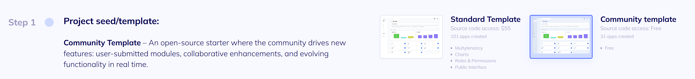

## This repository contains the source code for the **Flatlogic** generator's template.

### This project is a **template** and cannot be run directly. To generate an application from it:
* Go to the [**Flatlogic**](https://flatlogic.com/projects/new).
* In the list of available templates, select **Community template**.



The cheatsheet below describes the API for customizing this template: the variables, macros, and syntax available during generation.
---
### Template Cheat Sheet

<details>
<summary><strong>Click to see the full example of the JSON schema</strong></summary>

```json
{
  "entities": [
    {
      "name": "users",
      "show_field": "firstName",
      "fields": [
        {
          "type": "string",
          "name": "firstName",
          "title": "First Name",
          "show_in_form": true,
          "show_in_table": true,
          "editable": false,
          "unique": false,
          "multiline": false
        },
        {
          "type": "string",
          "name": "lastName",
          "title": "Last Name",
          "show_in_form": true,
          "show_in_table": true,
          "editable": false,
          "unique": false,
          "multiline": false
        },
        {
          "type": "string",
          "name": "phoneNumber",
          "title": "Phone Number",
          "show_in_form": true,
          "show_in_table": true,
          "editable": false,
          "unique": false,
          "multiline": false
        },
        {
          "type": "string",
          "name": "email",
          "title": "E-Mail",
          "show_in_form": true,
          "show_in_table": true,
          "editable": false,
          "unique": true,
          "multiline": false
        },
        {
          "type": "boolean",
          "name": "disabled",
          "title": "Disabled",
          "show_in_form": true,
          "show_in_table": true,
          "editable": false,
          "unique": false
        },
        {
          "type": "images",
          "name": "avatar",
          "title": "Avatar",
          "show_in_form": true,
          "show_in_table": true,
          "editable": false,
          "unique": false
        },
        {
          "type": "string",
          "name": "password",
          "title": "Password",
          "show_in_form": false,
          "show_in_table": false,
          "editable": false,
          "unique": false,
          "multiline": false
        },
        {
          "show_in_form": false,
          "show_in_table": false,
          "editable": false,
          "unique": false,
          "type": "boolean",
          "name": "emailVerified",
          "title": "Email Verified"
        },
        {
          "type": "string",
          "name": "emailVerificationToken",
          "title": "Email Verification Token",
          "show_in_form": false,
          "show_in_table": false,
          "editable": false,
          "unique": false,
          "multiline": false
        },
        {
          "type": "datetime",
          "name": "emailVerificationTokenExpiresAt",
          "title": "Email Verification Token Expires At",
          "show_in_form": false,
          "show_in_table": false,
          "editable": false,
          "unique": false
        },
        {
          "type": "string",
          "name": "passwordResetToken",
          "title": "Password Reset Token",
          "show_in_form": false,
          "show_in_table": false,
          "editable": false,
          "unique": false,
          "multiline": false
        },
        {
          "type": "datetime",
          "name": "passwordResetTokenExpiresAt",
          "title": "Password Reset Token Expires At",
          "show_in_form": false,
          "show_in_table": false,
          "editable": false,
          "unique": false
        },
        {
          "type": "string",
          "name": "provider",
          "title": "Provider",
          "show_in_form": false,
          "show_in_table": false,
          "editable": false,
          "unique": false,
          "multiline": false
        },
        {
          "name": "app_role",
          "type": "relation_one",
          "show_in_form": true,
          "show_in_table": true,
          "editable": false,
          "title": "App Role",
          "unique": false,
          "ref": "roles"
        },
        {
          "name": "custom_permissions",
          "type": "relation_many",
          "show_in_form": true,
          "show_in_table": true,
          "editable": false,
          "title": "Custom Permissions",
          "unique": false,
          "ref": "permissions"
        }
      ]
    },
    {
      "name": "roles",
      "show_field": "name",
      "editable": false,
      "fields": [
        {
          "name": "name",
          "type": "string",
          "multiline": false,
          "wysiwygEditor": false,
          "show_in_form": true,
          "show_in_table": true,
          "editable": false,
          "title": "Name",
          "unique": false
        },
        {
          "name": "role_customization",
          "type": "string",
          "multiline": false,
          "wysiwygEditor": false,
          "show_in_form": false,
          "show_in_table": false,
          "editable": false,
          "title": "Role Customization",
          "unique": false
        },
        {
          "name": "permissions",
          "type": "relation_many",
          "show_in_form": true,
          "show_in_table": true,
          "editable": false,
          "title": "Permissions",
          "unique": false,
          "ref": "permissions"
        }
      ]
    },
    {
      "name": "permissions",
      "show_field": "name",
      "editable": false,
      "fields": [
        {
          "name": "name",
          "type": "string",
          "multiline": false,
          "wysiwygEditor": false,
          "show_in_form": true,
          "show_in_table": true,
          "editable": false,
          "title": "Name",
          "unique": false
        }
      ]
    }
  ],
  "short_description": "A comprehensive hub for managing online education courses and users.",
  "title": "My Project"
}
```
</details>

### 1. Global objects injected into every `.erb`

| Variable | Type          | Meaning                                                         |
| -------- | ------------- | --------------------------------------------------------------- |
| `@schema` | `Hash`        | Full JSON project skeleton.                                    |
| `@entities` | `Array<Hash>` | Shortcut for `@schema['entities']`.                           |
| `@migrations`, `@seeds` | `Array`        | Raw migration / seed arrays.                          |
| `@project_with_web_site` | `Boolean`     | `true` if the project includes a public web-site.     |
| `@component_types` | `Array<String>` | Unique list of component types used by the web-site.   |

---

### 2. Extra objects available **when the file/dir name contains `((name))`, `{{Name}}`, etc.**

| Variable     | Type            | Meaning                                                           |
| ------------ | --------------- | ----------------------------------------------------------------- |
| `@name`      | `String`        | Current entity name (`snake_case`).                               |
| `@entity`    | `Hash`          | Full entity record.                                               |
| `@fields`    | `Array<Hash>`   | Shortcut for `@entity['fields']`.                                 |
| `@all_fields`| `Array<Hash>`   | All fields from all entities; each field has `field['entity_name']`. |

---

### 3. Single `field` structure

````
field = {
  '@name'     => 'firstName',
  '@name_cap' => 'FirstName',
  '@type'     => 'string',
  '@ref'      => 'users',          # present only for relations
  'title'     => 'First Name',
  'unique'    => false,
  # …plus any other keys from the schema
}
````
### 4. Placeholder macros

| Macro                     | Replaced by                  |
|---------------------------|------------------------------|
| `((name))` / `{{name}}`   | `users`                      |
| `((Name))` / `{{Name}}`   | `Users`                      |
| `((NAME))`                | `USERS`                      |
| `{{migration-timestamp}}` | *Epoch ms* of the migration  |
| `{{seed-timestamp}}`      | `YYYYMMDDHHMMSS` of the seed |

*Any path that contains one of these tokens is cloned for **each** entity.*

---

### 6. Worked example

```erb
form_fields = @fields.select { |f| f['@type'] == 'relation_one' }
form_fields.each do |f|
  await ((name)).set<%= f['@name_cap'] %>(data.<%= f['@name'] %> || null, { transaction })
end
```
## More ERB-style snippets

### A. Simple sidebar route list


<!-- sidebarRoutes.ts -->
```erb
export const routes = [
<% @entities.each_with_index do |e, i| %>
  { path: '/<%= e['@name'] %>', label: '<%= e['@name_cap'] %>' }<%= ',' unless i == @entities.size - 1 %>
<% end %>
];
```
### Sequelize model attributes (primitive fields only)
```erb
  attributes: {
<% @fields.select { |f| %w[string int decimal boolean date datetime enum].include?(f['@type']) }.each do |f| %>
  <%= f['@name'] %>: {
    type: DataTypes.<%= get_sequelize_field_type(f['@type']) %>,
  },
<% end %>
},
```

### TypeScript enums for every enum field in every entity
```erb
<!-- enums.ts -->
<% @entities.each do |e| %>
    <% e['fields'].select { |f| f['@type'] == 'enum' }.each do |f| %>
    export enum <%= e['@name_cap'] %><%= f['@name_cap'] %>Enum {
        <% f['options'].each do |o| %>
          <%= o.upcase %> = '<%= o %>',
        <% end %>
    }
    <% end %>
<% end %>
```

### Generating a REST-style URL map (all entities → list & detail)
```erb
# migration_log.md
<% @migrations.each do |m| %>
### <%= Time.at(m['time'] / 1000).utc.strftime('%Y-%m-%d %H:%M:%S') %>

<% m['changes'].each do |ch| %>
- **<%= ch['type'] %>** on **<%= ch.dig('payload','table') || ch['tables'] %>**
<% end %>

<% end %>
```
